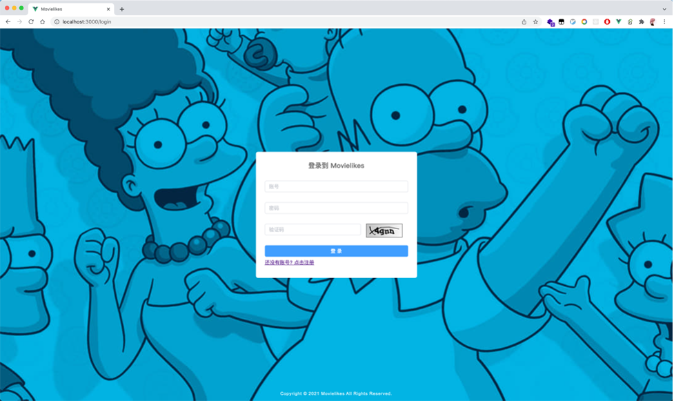
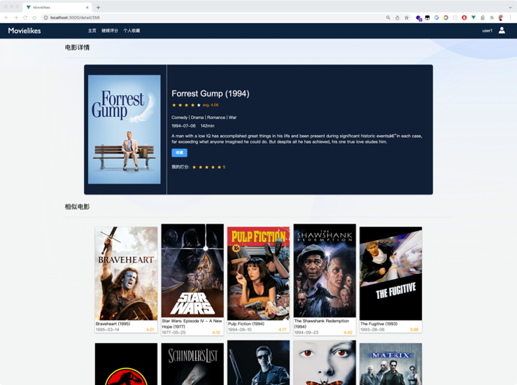
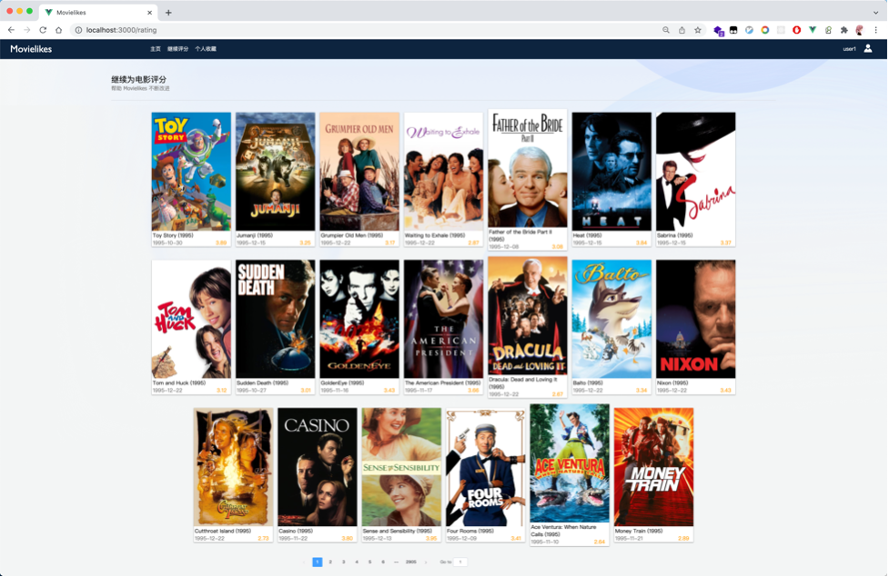

# com.yankaizhang.movielikes

专业综合设计

电影推荐系统movielikes

## 小组成员

- 张艳锴 20185813
- 金凝 20184345
- 廖嘉宇 20184224
- 杨冬宇 20184772

## 项目启动

### 推荐部分
请参考Scala+Spark环境配置搭建推荐部分依赖环境。

### 后端项目
后端工程为SpringBoot工程，依赖下载完成后运行MovielikesApplication </br>  
在application.yml中修改项目配置

### 前端工程
1. cd进入前端工程目录
```shell
$ cd web
```
2. yarn安装依赖
```shell
$ yarn
```
3. yarn dev运行dev环境测试
```shell
$ yarn dev
```
4. yarn build执行生成打包
```shell
$ yarn build
```

## 项目展示






